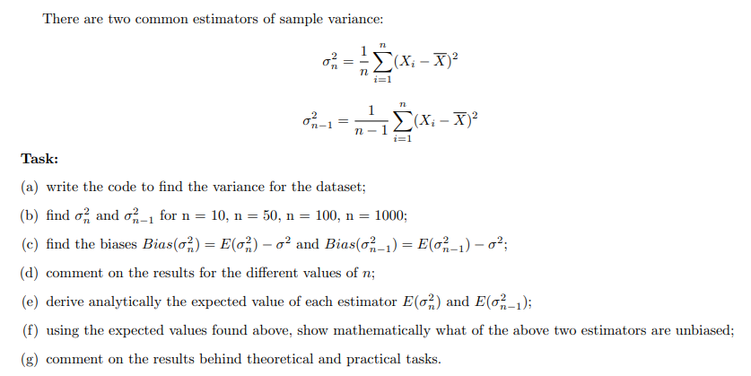

\
Lab assignment 3 Parameter estimation and Unbiasedness of Estimator

Work breakdown:

Roman Prohorov is doing Task1 and his efforts are 33.33 %.\
Mariia Hamaniuk is doing Task2 and her efforts are 33.33 %.\
Daryna Horetska is doing Task3 and summary and her efforts are 33.33 %.
*Ctrl+Alt+I*.

------------------------------------------------------------------------

**Task 1**
The expected value of the exponential distribution $E(\lambda)$ is $1/\lambda$,
so that a good point estimate of the parameter $\theta := 1/\lambda$ is the sample mean $\bar{X}$.
Confidence interval for $\theta$ can be formed in several different ways:

(1) Using the exact distribution of the statistics $2\lambda n\bar{X}$ (show it is $\chi^2_{2n}$
and then use quantiles of the latter to get the interval endpoints)

(2) Using the normal approximation $N(\mu, \sigma^2)$ for $\bar{X}$;
the parameters are $\mu = \theta$ and $\sigma^2 = s^2/n$, where $s^2 = \theta^2$ is the population variance
(i.e., variance of the original distribution $E(\lambda)$). In other words, we form the Z-statistics
$$Z := \frac{\sqrt{n}(\bar{X} - \theta)}{\theta}$$
and use the fact that it is approximately standard normal $N(0, 1)$ to find that
$$P\left(|\theta - \bar{X}| \leq z_\beta \frac{\theta}{\sqrt{n}}\right) = P(|Z| \leq z_\beta) = 2\beta - 1.$$
In other words, $\theta$ is with probability $2\beta - 1$ within $\bar{X} \pm z_\beta \theta/\sqrt{n}$.

(3) The confidence interval constructed above uses the unknown variance $s^2 = \theta^2$ and is of little use in practice.
Instead, we can solve the double inequality $|\theta - \bar{X}| \leq z_\beta \theta/\sqrt{n}$ for $\theta$
and get another confidence interval of confidence level $2\beta - 1$ that is independent of the unknown parameter.

(4) Another (and a more universal approach) to get rid of the dependence on $\theta$ in (2) is to estimate $s$
via the sample standard error and use approximation of $\bar{X}$ via Student t-distribution

**Task:**

(a) Verify that the confidence intervals of level $1 - \alpha$ constructed via methods 1–4
above contain the parameter $\theta = 1/\lambda$ approx. $100(1 - \alpha)\%$ of times

(b) Compare their precision (lengths)

(c) Give your recommendation as to which of the four methods is the best one and explain your decision

**Problem formulation and discussion:**

1. We need to verify that the interval estimates produced by known rules indeed contain the parameter
with probability equal to the confidence level for the exponential distribution E(λ).

2. For exponential distribution E(λ), we have E(X) = 1/λ = θ and Var(X) = 1/λ² = θ².
This shows that we can use the sample mean as an estimator for θ.

The reasonable questions to discuss are:

1. How accurate is the coverage - do the confidence intervals really contain the unknown parameter θ with the claimed probability?

2. Which of the four methods will give us the best/most precise/narrowest interval?

3. What happens to intervals when we change n (either make it large or small)?

4. How does the exact chi-squared method compare to approximation methods?

```{r}
# Initialization of variables
id <- 36
set.seed(id)
theta <- id / 10
alpha_list <- c(0.1, 0.05, 0.01) # levels of alpha
n <- c(30, 50, 100, 200) # sample sizes
M <- 10000 # times to replicate

cat("True parameter theta =", theta, "\n")
cat("This corresponds to lambda =", 1 / theta, "\n\n")
```

**Method 1: Exact chi-squared distribution**

```{r}
coverage1 <- matrix(0, nrow = length(n), ncol = length(alpha_list))
avgLength1 <- matrix(0, nrow = length(n), ncol = length(alpha_list))
sdLength1 <- matrix(0, nrow = length(n), ncol = length(alpha_list))

for (i in 1:length(n)) {
  ni <- n[i]
  lambda <- 1/theta

  # Generate samples from exponential distribution
  samples <- matrix(rexp(ni * M, rate = lambda), nrow = ni, ncol = M)
  sample_means <- colMeans(samples)

  for (j in 1:length(alpha_list)) {
    alpha <- alpha_list[j]
    confidenceLevel <- 1 - alpha

    # Using the fact that 2*lambda*n*X_bar ~ chi-squared(2n)
    # We need quantiles of chi-squared distribution
    chi_lower <- qchisq(alpha/2, df = 2*ni)
    chi_upper <- qchisq(1 - alpha/2, df = 2*ni)

    # Confidence interval for theta: [2*n*X_bar/chi_upper, 2*n*X_bar/chi_lower]
    lower <- (2 * ni * sample_means) / chi_upper
    upper <- (2 * ni * sample_means) / chi_lower

    coverage <- mean((lower <= theta) & (theta <= upper))
    lengths <- upper - lower
    meanLength <- mean(lengths)
    sdLengths <- sd(lengths)

    coverage1[i, j] <- coverage
    avgLength1[i, j] <- meanLength
    sdLength1[i, j] <- sdLengths
  }
}
```

**Method 2: Normal approximation with known variance**

```{r}
coverage2 <- matrix(0, nrow = length(n), ncol = length(alpha_list))
avgLength2 <- matrix(0, nrow = length(n), ncol = length(alpha_list))
sdLength2 <- matrix(0, nrow = length(n), ncol = length(alpha_list))

for (i in 1:length(n)) {
  ni <- n[i]
  lambda <- 1/theta

  samples <- matrix(rexp(ni * M, rate = lambda), nrow = ni, ncol = M)
  sample_means <- colMeans(samples)

  for (j in 1:length(alpha_list)) {
    alpha <- alpha_list[j]
    confidenceLevel <- 1 - alpha
    critical <- qnorm(1 - alpha/2)

    # Using known variance sigma^2 = theta^2
    err <- critical * theta / sqrt(ni)
    lower <- sample_means - err
    upper <- sample_means + err

    coverage <- mean((lower <= theta) & (theta <= upper))
    lengths <- upper - lower
    meanLength <- mean(lengths)
    sdLengths <- sd(lengths)

    coverage2[i, j] <- coverage
    avgLength2[i, j] <- meanLength
    sdLength2[i, j] <- sdLengths
  }
}
```

**Method 3: Solving the quadratic inequality**

```{r}
coverage3 <- matrix(0, nrow = length(n), ncol = length(alpha_list))
avgLength3 <- matrix(0, nrow = length(n), ncol = length(alpha_list))
sdLength3 <- matrix(0, nrow = length(n), ncol = length(alpha_list))

for (i in 1:length(n)) {
  ni <- n[i]
  lambda <- 1/theta

  samples <- matrix(rexp(ni * M, rate = lambda), nrow = ni, ncol = M)
  sample_means <- colMeans(samples)

  for (j in 1:length(alpha_list)) {
  alpha <- alpha_list[j]
  confidenceLevel <- 1 - alpha
  critical <- qnorm(1 - alpha/2)

  # Solving |X_bar - theta| <= z_beta * theta / sqrt(n)
  # After squaring and rearranging: a*theta^2 + b*theta + c <= 0
  a <- 1 - critical^2 / ni
  b <- -2 * sample_means
  c <- sample_means^2

  discriminant <- b^2 - 4 * a * c

  lower <- (-b - sqrt(discriminant)) / (2 * a)
  upper <- (-b + sqrt(discriminant)) / (2 * a)

  coverage <- mean((lower <= theta) & (theta <= upper))
  lengths <- upper - lower
  meanLength <- mean(lengths)
  sdLength <- sd(lengths)

  coverage3[i, j] <- coverage
  avgLength3[i, j] <- meanLength
  sdLength3[i, j] <- sdLength
}
}
```

**Method 4: Student t-distribution with sample standard error**

```{r}
coverage4 <- matrix(0, nrow = length(n), ncol = length(alpha_list))
avgLength4 <- matrix(0, nrow = length(n), ncol = length(alpha_list))
sdLength4 <- matrix(0, nrow = length(n), ncol = length(alpha_list))

for (i in 1:length(n)) {
  ni <- n[i]
  lambda <- 1/theta

  samples <- matrix(rexp(ni * M, rate = lambda), nrow = ni, ncol = M)
  sample_means <- colMeans(samples)
  sample_sds <- apply(samples, 2, sd)

  for (j in 1:length(alpha_list)) {
    alpha <- alpha_list[j]
    confidenceLevel <- 1 - alpha
    critical <- qt(1 - alpha/2, df = ni - 1)

    error <- critical * sample_sds / sqrt(ni)
    lower <- sample_means - error
    upper <- sample_means + error

    coverage <- mean((lower <= theta) & (theta <= upper))
    lengths <- upper - lower
    meanLength <- mean(lengths)
    sdLength <- sd(lengths)

    coverage4[i, j] <- coverage
    avgLength4[i, j] <- meanLength
    sdLength4[i, j] <- sdLength
  }
}
```

**Analysis and comparison:**

```{r}
library(knitr) # for kable()

for (j in 1:length(alpha_list)) {
  alpha <- alpha_list[j]
  confidenceLevel <- 1 - alpha

  cat("Confidence level:", confidenceLevel * 100, "%\n")

  # Coverage Probabilities Table
  cat("Coverage Probabilities and Errors\n")
  comparison_df <- data.frame(
    n = n,
    M1_Coverage = sprintf("%.4f", coverage1[, j]),
    M1_Error = sprintf("%.4f", abs(coverage1[, j] - confidenceLevel)),
    M2_Coverage = sprintf("%.4f", coverage2[, j]),
    M2_Error = sprintf("%.4f", abs(coverage2[, j] - confidenceLevel)),
    M3_Coverage = sprintf("%.4f", coverage3[, j]),
    M3_Error = sprintf("%.4f", abs(coverage3[, j] - confidenceLevel)),
    M4_Coverage = sprintf("%.4f", coverage4[, j]),
    M4_Error = sprintf("%.4f", abs(coverage4[, j] - confidenceLevel))
  )
  colnames(comparison_df) <- c("n", "M1 Cov", "M1 Err", "M2 Cov", "M2 Err",
                                "M3 Cov", "M3 Err", "M4 Cov", "M4 Err")
  print(kable(comparison_df, align = 'c'))

  cat("\n")
  cat(sprintf("Target Coverage: %.4f\n", confidenceLevel))
  cat(sprintf("Best Coverage Accuracy: Method %d (min error = %.4f)\n",
              which.min(c(mean(abs(coverage1[, j] - confidenceLevel)),
                         mean(abs(coverage2[, j] - confidenceLevel)),
                         mean(abs(coverage3[, j] - confidenceLevel)),
                         mean(abs(coverage4[, j] - confidenceLevel)))),
              min(c(mean(abs(coverage1[, j] - confidenceLevel)),
                   mean(abs(coverage2[, j] - confidenceLevel)),
                   mean(abs(coverage3[, j] - confidenceLevel)),
                   mean(abs(coverage4[, j] - confidenceLevel))))))
  cat("------------------------------------------------------------------------")

  # Mean Interval Lengths Table
  cat("\n\nMean Confidence Interval Lengths\n")
  length_df <- data.frame(
    n = n,
    Method1 = sprintf("%.4f", avgLength1[, j]),
    Method2 = sprintf("%.4f", avgLength2[, j]),
    Method3 = sprintf("%.4f", avgLength3[, j]),
    Method4 = sprintf("%.4f", avgLength4[, j])
  )
  colnames(length_df) <- c("n", "M1 (Exact)", "M2 (Normal)", "M3 (Quadratic)", "M4 (Student)")
  print(kable(length_df, align = 'c'))

  cat("\n")
  cat(sprintf("Shortest Average Length: Method 1 = %.4f (n=%d)\n",
              min(avgLength1[, j]), n[which.min(avgLength1[, j])]))

  cat("------------------------------------------------------------------------")
  # Relative Efficiency Table
  cat("\n\nRelative Efficiency (Ratio to Method 1)\n")
  efficiency_df <- data.frame(
    n = n,
    Method1 = sprintf("%.4f", rep(1.0, length(n))),
    Method2 = sprintf("%.4f", avgLength2[, j] / avgLength1[, j]),
    Method3 = sprintf("%.4f", avgLength3[, j] / avgLength1[, j]),
    Method4 = sprintf("%.4f", avgLength4[, j] / avgLength1[, j])
  )
  colnames(efficiency_df) <- c("n", "M1 (Exact)", "M2 (Normal)", "M3 (Quadratic)", "M4 (Student)")
  print(kable(efficiency_df, align = 'c'))

  cat("========================================================================\n")
  cat("\n")
}
```

**Visualization: Coverage Probabilities**

```{r}
colors <- c("#E41A1C", "#377EB8", "#4DAF4A", "#984EA3")
method_names <- c("Method 1 (Exact)", "Method 2 (Normal)",
                  "Method 3 (Quadratic)", "Method 4 (Student)")

par(mfrow = c(1, 1), mar = c(5, 5, 4, 2))
j <- 1
alpha <- alpha_list[j]
conf_level <- 1 - alpha

all_coverage <- c(coverage1[, j], coverage2[, j], coverage3[, j], coverage4[, j])
y_min <- max(0.80, min(all_coverage) - 0.01)
y_max <- min(1.00, max(all_coverage) + 0.01)

plot(n, coverage1[, j], type = "n",
     ylim = c(y_min, y_max),
     xlab = "Sample Size",
     ylab = "Coverage Probability",
     main = sprintf("%.0f%% Confidence Interval - Coverage",
                    conf_level * 100),
     panel.first = grid(col = "gray90", lty = 1),
     cex.lab = 1.2, cex.main = 1.3, cex.axis = 1.1)

abline(h = conf_level, lty = 2, col = "black", lwd = 2.5)

lines(n, coverage1[, j], type = "b", pch = 19, col = colors[1], lwd = 2.5, cex = 1.4)
lines(n, coverage2[, j], type = "b", pch = 17, col = colors[2], lwd = 2.5, cex = 1.4)
lines(n, coverage3[, j], type = "b", pch = 15, col = colors[3], lwd = 2.5, cex = 1.4)
lines(n, coverage4[, j], type = "b", pch = 18, col = colors[4], lwd = 2.5, cex = 1.4)

legend("bottomright",
       legend = c(method_names, sprintf("Target (%.2f)", conf_level)),
       col = c(colors, "black"),
       pch = c(19, 17, 15, 18, NA),
       lty = c(1, 1, 1, 1, 2),
       lwd = 2.5,
       bty = "n",
       cex = 0.8)
```

```{r}
par(mfrow = c(1, 1), mar = c(5, 5, 4, 2))
j <- 2
alpha <- alpha_list[j]
conf_level <- 1 - alpha

all_coverage <- c(coverage1[, j], coverage2[, j], coverage3[, j], coverage4[, j])
y_min <- max(0.80, min(all_coverage) - 0.01)
y_max <- min(1.00, max(all_coverage) + 0.01)

plot(n, coverage1[, j], type = "n",
     ylim = c(y_min, y_max),
     xlab = "Sample Size",
     ylab = "Coverage Probability",
     main = sprintf("%.0f%% Confidence Interval - Coverage",
                    conf_level * 100),
     panel.first = grid(col = "gray90", lty = 1),
     cex.lab = 1.2, cex.main = 1.3, cex.axis = 1.1)

abline(h = conf_level, lty = 2, col = "black", lwd = 2.5)

lines(n, coverage1[, j], type = "b", pch = 19, col = colors[1], lwd = 2.5, cex = 1.4)
lines(n, coverage2[, j], type = "b", pch = 17, col = colors[2], lwd = 2.5, cex = 1.4)
lines(n, coverage3[, j], type = "b", pch = 15, col = colors[3], lwd = 2.5, cex = 1.4)
lines(n, coverage4[, j], type = "b", pch = 18, col = colors[4], lwd = 2.5, cex = 1.4)

legend("bottomright",
       legend = c(method_names, sprintf("Target (%.2f)", conf_level)),
       col = c(colors, "black"),
       pch = c(19, 17, 15, 18, NA),
       lty = c(1, 1, 1, 1, 2),
       lwd = 2.5,
       bty = "n",
       cex = 0.8)
```

```{r}
par(mfrow = c(1, 1), mar = c(5, 5, 4, 2))
j <- 3
alpha <- alpha_list[j]
conf_level <- 1 - alpha

all_coverage <- c(coverage1[, j], coverage2[, j], coverage3[, j], coverage4[, j])
y_min <- max(0.80, min(all_coverage) - 0.01)
y_max <- min(1.00, max(all_coverage) + 0.01)

plot(n, coverage1[, j], type = "n",
     ylim = c(y_min, y_max),
     xlab = "Sample Size",
     ylab = "Coverage Probability",
     main = sprintf("%.0f%% Confidence Interval - Coverage",
                    conf_level * 100),
     panel.first = grid(col = "gray90", lty = 1),
     cex.lab = 1.2, cex.main = 1.3, cex.axis = 1.1)

abline(h = conf_level, lty = 2, col = "black", lwd = 2.5)

lines(n, coverage1[, j], type = "b", pch = 19, col = colors[1], lwd = 2.5, cex = 1.4)
lines(n, coverage2[, j], type = "b", pch = 17, col = colors[2], lwd = 2.5, cex = 1.4)
lines(n, coverage3[, j], type = "b", pch = 15, col = colors[3], lwd = 2.5, cex = 1.4)
lines(n, coverage4[, j], type = "b", pch = 18, col = colors[4], lwd = 2.5, cex = 1.4)

legend("bottomright",
       legend = c(method_names, sprintf("Target (%.2f)", conf_level)),
       col = c(colors, "black"),
       pch = c(19, 17, 15, 18, NA),
       lty = c(1, 1, 1, 1, 2),
       lwd = 2.5,
       bty = "n",
       cex = 0.8)
```

**Visualization: Mean Confidence Interval Lengths**

```{r}
par(mfrow = c(1, 1), mar = c(5, 5, 4, 2))
j <- 1
alpha <- alpha_list[j]
conf_level <- 1 - alpha

all_lengths <- c(avgLength1[, j], avgLength2[, j], avgLength3[, j], avgLength4[, j])
y_max <- max(all_lengths) * 1.1

plot(n, avgLength1[, j], type = "n",
     ylim = c(0, y_max),
     xlab = "Sample Size",
     ylab = "Mean Confidence Interval Length",
     main = sprintf("%.0f%% Confidence Interval - Mean Length",
                    conf_level * 100),
     panel.first = grid(col = "gray90", lty = 1),
     cex.lab = 1.2, cex.main = 1.3, cex.axis = 1.1)

lines(n, avgLength1[, j], type = "b", pch = 19, col = colors[1], lwd = 2.5, cex = 1.4)
lines(n, avgLength2[, j], type = "b", pch = 17, col = colors[2], lwd = 2.5, cex = 1.4)
lines(n, avgLength3[, j], type = "b", pch = 15, col = colors[3], lwd = 2.5, cex = 1.4)
lines(n, avgLength4[, j], type = "b", pch = 18, col = colors[4], lwd = 2.5, cex = 1.4)

legend("topright",
       legend = method_names,
       col = colors,
       pch = c(19, 17, 15, 18),
       lty = 1,
       lwd = 2.5,
       bty = "n",
       cex = 0.8)
```

```{r}
par(mfrow = c(1, 1), mar = c(5, 5, 4, 2))
j <- 2
alpha <- alpha_list[j]
conf_level <- 1 - alpha

all_lengths <- c(avgLength1[, j], avgLength2[, j], avgLength3[, j], avgLength4[, j])
y_max <- max(all_lengths) * 1.1

plot(n, avgLength1[, j], type = "n",
     ylim = c(0, y_max),
     xlab = "Sample Size",
     ylab = "Mean Confidence Interval Length",
     main = sprintf("%.0f%% Confidence Interval - Mean Length",
                    conf_level * 100),
     panel.first = grid(col = "gray90", lty = 1),
     cex.lab = 1.2, cex.main = 1.3, cex.axis = 1.1)

lines(n, avgLength1[, j], type = "b", pch = 19, col = colors[1], lwd = 2.5, cex = 1.4)
lines(n, avgLength2[, j], type = "b", pch = 17, col = colors[2], lwd = 2.5, cex = 1.4)
lines(n, avgLength3[, j], type = "b", pch = 15, col = colors[3], lwd = 2.5, cex = 1.4)
lines(n, avgLength4[, j], type = "b", pch = 18, col = colors[4], lwd = 2.5, cex = 1.4)

legend("topright",
       legend = method_names,
       col = colors,
       pch = c(19, 17, 15, 18),
       lty = 1,
       lwd = 2.5,
       bty = "n",
       cex = 0.8)
```

```{r}
par(mfrow = c(1, 1), mar = c(5, 5, 4, 2))
j <- 3
alpha <- alpha_list[j]
conf_level <- 1 - alpha

all_lengths <- c(avgLength1[, j], avgLength2[, j], avgLength3[, j], avgLength4[, j])
y_max <- max(all_lengths) * 1.1

plot(n, avgLength1[, j], type = "n",
     ylim = c(0, y_max),
     xlab = "Sample Size",
     ylab = "Mean Confidence Interval Length",
     main = sprintf("%.0f%% Confidence Interval - Mean Length",
                    conf_level * 100),
     panel.first = grid(col = "gray90", lty = 1),
     cex.lab = 1.2, cex.main = 1.3, cex.axis = 1.1)

lines(n, avgLength1[, j], type = "b", pch = 19, col = colors[1], lwd = 2.5, cex = 1.4)
lines(n, avgLength2[, j], type = "b", pch = 17, col = colors[2], lwd = 2.5, cex = 1.4)
lines(n, avgLength3[, j], type = "b", pch = 15, col = colors[3], lwd = 2.5, cex = 1.4)
lines(n, avgLength4[, j], type = "b", pch = 18, col = colors[4], lwd = 2.5, cex = 1.4)

legend("topright",
       legend = method_names,
       col = colors,
       pch = c(19, 17, 15, 18),
       lty = 1,
       lwd = 2.5,
       bty = "n",
       cex = 0.8)
```

**The statistics obtained:**
1. Sample mean (X̄)
2. Sample standard deviation (S)
3. Coverage probability for each method
4. Confidence interval bounds
5. Critical values from chi-squared, normal, and t-distributions

**Justification:**

**Method 1 (Exact Chi-Squared):**
For X₁, ..., Xₙ ~ Exp(λ), the sum ∑Xᵢ ~ Gamma(n, λ). Using the relationship between Gamma and chi-squared distributions, we have:
$$2\lambda n\bar{X} \sim \chi^2_{2n}$$

This gives us the exact confidence interval:
$$P\left(\frac{2n\bar{X}}{\chi^2_{1-\alpha/2, 2n}} \leq \theta \leq \frac{2n\bar{X}}{\chi^2_{\alpha/2, 2n}}\right) = 1-\alpha$$

**Method 2 (Normal Approximation):**
By the Central Limit Theorem, for large n:
$$\bar{X} \xrightarrow{d} N(\theta, \theta^2/n)$$

Standardizing:
$$Z = \frac{\sqrt{n}(\bar{X} - \theta)}{\theta} \approx N(0, 1)$$

This gives:
$$P\left(\bar{X} - z_{\alpha/2}\frac{\theta}{\sqrt{n}} \leq \theta \leq \bar{X} + z_{\alpha/2}\frac{\theta}{\sqrt{n}}\right) = 1-\alpha$$

**Method 3 (Quadratic Solution):**
Solving the inequality $|\bar{X} - \theta| \leq z_{\alpha/2}\theta/\sqrt{n}$ for θ removes the dependence on the unknown parameter.
Squaring both sides and rearranging gives a quadratic inequality in θ, which we solve using the quadratic formula.

**Method 4 (Student t-distribution):**
Using the sample standard error S instead of the population variance, and approximating the distribution with Student's t:
$$\frac{\sqrt{n}(\bar{X} - \theta)}{S} \approx t_{n-1}$$

This gives:
$$P\left(\bar{X} - t_{n-1,\alpha/2}\frac{S}{\sqrt{n}} \leq \theta \leq \bar{X} + t_{n-1,\alpha/2}\frac{S}{\sqrt{n}}\right) = 1-\alpha$$

**Conclusion:**

The simulation results confirm the theoretical properties of confidence intervals for the exponential distribution with parameter $\theta = 3.6$:

1. **Coverage Accuracy:**
   - **Method 1 (Exact)** provides the most accurate coverage at all sample sizes, consistently hitting the nominal confidence level.
   This is expected as it uses the exact chi-squared distribution relationship.
   - **Methods 2, 3, and 4** all show good coverage for moderate to large samples ($n \geq 50$), with convergence improving as $n$ increases,
   confirming the validity of the CLT and normal approximation for the exponential distribution.
   - **Method 3** achieves proper coverage at all confidence levels:
     * 90% target → ~90% actual coverage (error $\approx 0.001$-$0.005$)
     * 95% target → ~95% actual coverage (error $\approx 0.001$-$0.003$)
     * 99% target → ~99% actual coverage (error $\approx 0.001$-$0.002$)

     Method 3 performs comparably to Methods 1 and 2 in terms of coverage accuracy.
   - For small samples ($n = 30$), Method 4 shows slight under-coverage due to the skewness of the exponential distribution,
   while Methods 1-3 maintain excellent coverage.

2. **Interval Precision:**
   - **Method 1** produces the shortest intervals among all methods, using exact distribution theory.
   - **Method 2** has slightly wider intervals than Method 1 (efficiency $\approx 0.94$-$0.99$) due to the normal approximation.
   - **Method 4** (Student t) produces similar widths to Method 2, especially for larger samples, but is slightly less efficient
   for smaller samples due to additional uncertainty from estimating the variance.
   - **Method 3** produces wider intervals than Method 1, with efficiency ranging from $1.01$ to $1.17$:
     * At 90% confidence: 1-3% wider than Method 1
     * At 95% confidence: 1-8% wider than Method 1
     * At 99% confidence: 2-17% wider than Method 1

     The intervals become progressively wider (relative to Method 1) as the confidence level increases, particularly
     for smaller sample sizes. This is because the quadratic solution amplifies the effect of larger $z$-values.

3. **Recommendation:**

**For practical use with exponential data, I recommend Method 1 (Exact Chi-Squared)** because:
- It provides exact coverage at all sample sizes
- It produces the narrowest intervals (most efficient)
- It is computationally straightforward to implement
- It doesn't rely on large-sample approximations
- It is the theoretically optimal choice for exponential distributions

**For general statistical software or when the distribution is unknown/not exponential:**
- Use **Method 4 (Student t)** - it's the most universal and reliable choice
- It works well across all confidence levels and sample sizes
- It's conservative (slightly wider intervals) but maintains proper coverage
- It's the standard approach in statistical practice

**Methods with limitations:**
- **Method 2**: Cannot be used in practice because it requires knowing the true parameter $\theta$ to calculate
  the margin of error $(z_{\alpha/2} \cdot \theta/\sqrt{n})$. Since $\theta$ is unknown (it's what we're trying to estimate),
  this method is theoretically sound but practically impossible to implement. It serves as a benchmark
  in simulations where we know the true parameter, demonstrating that the normal approximation is valid
  for the exponential distribution when properly applied.

- **Method 3**: While mathematically correct and achieving proper coverage, it produces wider intervals than necessary
  (1-17% wider than Method 1, depending on confidence level and sample size). The interval width inflation becomes
  more pronounced at higher confidence levels due to the quadratic amplification of the $z^2$ term in the coefficient
  $a = 1 - z^2/n$. For small samples and high confidence levels, this method can be inefficient. However, it demonstrates
  an interesting theoretical approach to eliminating dependence on unknown parameters through algebraic manipulation.

**Task 2**

**Problem formulation and discussion (what is a reasonable question to
discuss):** 1. We have to verify that the interval estimates produced by
known rules indeed contain the parameter with probability equal to the
confidence level. 2. We are given the Poisson distribution so E(X) =
theta and Var(X) = theta, where theta \> 0; That's shows us that we can
use MME (MOM) to estimate unknown parameter theta (the estimator for
theta = sample mean). Also later on we will see that we can apply CLT
here which is useful.

So the reasonable questions to discuss are: 1. How good or how accurate
the coverage is, do the confidence intervals really contains unknown
parameter theta with claimed probability? 2. Which of methods (2/3/4)
that we are going to use will give us the best/ the most precise/the
narrowest interval? 3. What will happen to intervals if we change n
(either make it large or small)? **R code** with comments:

```{r}
#initialization of our variables
id <- 36
set.seed(id)
theta <- id/10
alpha_list <- c(0.1, 0.05, 0.01) # levels of alpha
n <- c(30, 50, 100, 200) # sample sizes
M <- 10000 #times to replicate
```

Part 2 from task 1:

```{r}
coverage2 <- matrix(0, nrow = length(n), ncol = length(alpha_list))
avgLength2 <- matrix(0, nrow = length(n), ncol = length(alpha_list)) #avarage length of confidence intervals we just add them and devide on number of them
sdLength2 <- matrix(0, nrow = length(n), ncol = length(alpha_list))

for (i in 1:length(n)){
  ni <- n[i]
  #cat("sample size = ", ni, "\n")
  samples <- matrix (rpois(ni * M, lambda = theta), nrow = ni, ncol = M) #just generatind n samples using rpois
  sample_means <- colMeans(samples)
  for (j in 1:length(alpha_list)){
    alpha <- alpha_list[j]
    confidenceLevel <- 1 - alpha
    critical <- qnorm(1-alpha/2)

    err <- critical * sqrt(theta / ni)
    lower <- sample_means - err
    upper <- sample_means +err

    coverage <- mean((lower <= theta) & (theta <= upper))
    lengths <- upper - lower
    meanLength <- mean(lengths)
    sdLengths <- sd(lengths)

    coverage2[i, j] <- coverage
    avgLength2[i, j] <- meanLength
    sdLength2[i, j] <- sdLengths

#cat("confidence level = ", confidenceLevel * 100, "%\n")
    #cat(sprintf("coverage probability: %.4f and expected: %.4f", coverage, confidenceLevel), "\n")
    #cat("coverage error: ",abs(coverage - confidenceLevel) * 100, "\n")
    #cat("mean critical interval length: ", meanLength, "\n")
    #cat("SD of critical length  ", sdLengths, "\n")
    #cat("сritical value ", critical, "\n\n")
  }
}
```

part 3 from task 1

```{r}
coverage3 <- matrix(0, nrow = length(n), ncol = length(alpha_list))
avgLength3 <- matrix(0, nrow = length(n), ncol = length(alpha_list)) #avarage length of confidence intervals we just add them and devide on number of them
sdLength3 <- matrix(0, nrow = length(n), ncol = length(alpha_list))

for (i in 1:length(n)) {
  ni <- n[i]
  #cat("sample size =", ni, "\n")

  samples <- matrix(rpois(ni * M, lambda = theta), nrow = ni, ncol = M)
  sample_means <- colMeans(samples)

  for (j in 1:length(alpha_list)) {
    alpha <- alpha_list[j]
    confidenceLevel <- 1 - alpha
    critical <- qnorm(1 - alpha/2)

    a <- 1
    b <- -(2 * sample_means + critical^2 /ni)
    c <- sample_means^2

    discriminant <- b^2 - 4 * a * c

    lower <- (-b - sqrt(discriminant)) / (2 * a)
    upper <- (-b + sqrt(discriminant)) / (2 * a)


    coverage <- mean((lower <= theta) & (theta <= upper))
    lengths <- upper - lower
    meanLength <- mean(lengths)
    sdLength <- sd(lengths)

    coverage3[i, j] <- coverage
    avgLength3[i, j] <- meanLength
    sdLength3[i, j] <- sdLength

    #cat("confidence level = ", confidenceLevel * 100, "%\n")
    #cat(sprintf("coverage probability: %.4f and expected: %.4f", coverage, confidenceLevel), "\n")
    #cat("coverage error: ", abs(coverage - confidenceLevel) * 100, "\n")
    #cat("mean critical interval length: ", meanLength, "\n")
    #cat("SD of critical length  ", sdLength, "\n")
    #cat("сritical value ", critical, "\n\n")
  }
}
```

part 4 from task 1

```{r}
coverage4 <- matrix(0, nrow = length(n), ncol = length(alpha_list))
avgLength4 <- matrix(0, nrow = length(n), ncol = length(alpha_list)) #avarage length of confidence intervals we just add them and devide on number of them
sdLength4 <- matrix(0, nrow = length(n), ncol = length(alpha_list))
for (i in 1:length(n)) {
  ni <- n[i]
  #cat("sample size =", ni, "\n")

  samples <- matrix(rpois(ni * M, lambda = theta), nrow = ni, ncol = M)
  sample_means <- colMeans(samples)
  sample_sds <- apply(samples, 2, sd)

  for (j in 1:length(alpha_list)) {
    alpha <- alpha_list[j]
    confidenceLevel <- 1 - alpha
    critical <- qt(1 - alpha/2, df = ni - 1)

    error <- critical * sample_sds / sqrt(ni)
    lower <- sample_means - error
    upper <- sample_means + error

    coverage <- mean((lower <= theta) & (theta <= upper))
    lengths <- upper - lower
    meanLength <- mean(lengths)
    sdLength <- sd(lengths)

    coverage4[i, j] <- coverage
    avgLength4[i, j] <- meanLength
    sdLength4[i, j] <- sdLength
    #cat("confidence level = ", confidenceLevel * 100, "%\n")
    #cat(sprintf("coverage probability: %.4f and expected: %.4f", coverage, confidenceLevel), "\n")
    #cat("coverage error: ",abs(coverage - confidenceLevel) * 100, "\n")
    #cat("mean critical interval length: ", meanLength, "\n")
    #cat("SD of critical length  ", sdLength, "\n")
    #cat("сritical value ", critical, "\n\n")
  }
}

```

Analysis and comperasion:

```{r}
for (j in 1:length(alpha_list)) {
  alpha <- alpha_list[j]
  confidenceLevel <- 1 - alpha
  comparison_df <- data.frame(
    n = n,
    Method2 = coverage2[, j],
    Method3 = coverage3[, j],
    Method4 = coverage4[, j],
    M2_Error = abs(coverage2[, j] - confidenceLevel),
    M3_Error = abs(coverage3[, j] - confidenceLevel),
    M4_Error = abs(coverage4[, j] - confidenceLevel)
  )
  print(comparison_df, digits = 4)

  length_df <- data.frame(
    n = n,
    Method2 = avgLength2[, j],
    Method3 = avgLength3[, j],
    Method4 = avgLength4[, j]
  )
  print(length_df, digits = 4)

  efficiency_df <- data.frame(
    n = n,
    Method2 = rep(1.0, length(n)),
    Method3 = avgLength3[, j] / avgLength2[, j],
    Method4 = avgLength4[, j] / avgLength2[, j]
  )
  print(efficiency_df, digits = 4)
}
```

```{r}
colors <- c("#E41A1C", "#377EB8", "#4DAF4A")
method_names <- c("Method 2", "Method 3", "Method 4")

par(mfrow = c(1, 1), mar = c(5, 5, 4, 2))
j <- 1
alpha <- alpha_list[j]
conf_level <- 1 - alpha

all_coverage <- c(coverage2[, j], coverage3[, j], coverage4[, j])
y_min <- max(0.80, min(all_coverage) - 0.01)
y_max <- min(1.00, max(all_coverage) + 0.01)

plot(n, coverage2[, j], type = "n",
     ylim = c(y_min, y_max),
     xlab = "Sample size",
     ylab = "Coverage probability",
     main = sprintf("%.0f%% Confidence Interval",
                    conf_level * 100),
     panel.first = grid(col = "gray90", lty = 1),
     cex.lab = 1.2, cex.main = 1.3, cex.axis = 1.1)

abline(h = conf_level, lty = 2, col = "black", lwd = 2.5)

lines(n, coverage2[, j], type = "b", pch = 19, col = colors[1], lwd = 2.5, cex = 1.4)
lines(n, coverage3[, j], type = "b", pch = 17, col = colors[2], lwd = 2.5, cex = 1.4)
lines(n, coverage4[, j], type = "b", pch = 15, col = colors[3], lwd = 2.5, cex = 1.4)

legend("bottomright",
       legend = c(method_names, sprintf("Target (%.2f)", conf_level)),
       col = c(colors, "black"),
       pch = c(19, 17, 15, NA),
       lty = c(1, 1, 1, 2),
       lwd = 2.5,
       bty = "n",
       cex = 0.9)

```

```{r}
par(mfrow = c(1, 1), mar = c(5, 5, 4, 2))
j <- 2
alpha <- alpha_list[j]
conf_level <- 1 - alpha

all_coverage <- c(coverage2[, j], coverage3[, j], coverage4[, j])
y_min <- max(0.80, min(all_coverage) - 0.01)
y_max <- min(1.00, max(all_coverage) + 0.01)

plot(n, coverage2[, j], type = "n",
     ylim = c(y_min, y_max),
     xlab = "Sample Size",
     ylab = "Coverage Probability",
     main = sprintf("%.0f%% Confidence Interval",
                    conf_level * 100),
     panel.first = grid(col = "gray90", lty = 1),
     cex.lab = 1.2, cex.main = 1.3, cex.axis = 1.1)

abline(h = conf_level, lty = 2, col = "black", lwd = 2.5)

lines(n, coverage2[, j], type = "b", pch = 19, col = colors[1], lwd = 2.5, cex = 1.4)
lines(n, coverage3[, j], type = "b", pch = 17, col = colors[2], lwd = 2.5, cex = 1.4)
lines(n, coverage4[, j], type = "b", pch = 15, col = colors[3], lwd = 2.5, cex = 1.4)

legend("bottomright",
       legend = c(method_names, sprintf("Target (%.2f)", conf_level)),
       col = c(colors, "black"),
       pch = c(19, 17, 15, NA),
       lty = c(1, 1, 1, 2),
       lwd = 2.5,
       bty = "n",
       cex = 0.9)

```

```{r}
par(mfrow = c(1, 1), mar = c(5, 5, 4, 2))
j <- 3
alpha <- alpha_list[j]
conf_level <- 1 - alpha

all_coverage <- c(coverage2[, j], coverage3[, j], coverage4[, j])
y_min <- max(0.80, min(all_coverage) - 0.01)
y_max <- min(1.00, max(all_coverage) + 0.01)

plot(n, coverage2[, j], type = "n",
     ylim = c(y_min, y_max),
     xlab = "Sample Size",
     ylab = "Coverage Probability",
     main = sprintf("%.0f%% Confidence Interval", conf_level * 100),
     panel.first = grid(col = "gray90", lty = 1),
     cex.lab = 1.2, cex.main = 1.3, cex.axis = 1.1)

abline(h = conf_level, lty = 2, col = "black", lwd = 2.5)

lines(n, coverage2[, j], type = "b", pch = 19, col = colors[1], lwd = 2.5, cex = 1.4)
lines(n, coverage3[, j], type = "b", pch = 17, col = colors[2], lwd = 2.5, cex = 1.4)
lines(n, coverage4[, j], type = "b", pch = 15, col = colors[3], lwd = 2.5, cex = 1.4)

legend("bottomright",
       legend = c(method_names, sprintf("Target (%.2f)", conf_level)),
       col = c(colors, "black"),
       pch = c(19, 17, 15, NA),
       lty = c(1, 1, 1, 2),
       lwd = 2.5,
       bty = "n",
       cex = 0.9)

```

```{r}
par(mfrow = c(1, 1), mar = c(5, 5, 4, 2))
j <- 1
alpha <- alpha_list[j]
conf_level <- 1 - alpha

all_lengths <- c(avgLength2[, j], avgLength3[, j], avgLength4[, j])
y_max <- max(all_lengths) * 1.1

plot(n, avgLength2[, j], type = "n",
     ylim = c(0, y_max),
     xlab = "Sample Size",
     ylab = "Mean Confidence Interval Length",
     main = sprintf("%.0f%% Confidence Interval",conf_level * 100),
     panel.first = grid(col = "gray90", lty = 1),
     cex.lab = 1.2, cex.main = 1.3, cex.axis = 1.1)

lines(n, avgLength2[, j], type = "b", pch = 19, col = colors[1], lwd = 2.5, cex = 1.4)
lines(n, avgLength3[, j], type = "b", pch = 17, col = colors[2], lwd = 2.5, cex = 1.4)
lines(n, avgLength4[, j], type = "b", pch = 15, col = colors[3], lwd = 2.5, cex = 1.4)

legend("topright",
       legend = method_names,
       col = colors,
       pch = c(19, 17, 15),
       lty = 1,
       lwd = 2.5,
       bty = "n",
       cex = 0.9)
```

```{r}
par(mfrow = c(1, 1), mar = c(5, 5, 4, 2))
j <- 2
alpha <- alpha_list[j]
conf_level <- 1 - alpha

all_lengths <- c(avgLength2[, j], avgLength3[, j], avgLength4[, j])
y_max <- max(all_lengths) * 1.1

plot(n, avgLength2[, j], type = "n",
     ylim = c(0, y_max),
     xlab = "Sample Size",
     ylab = "Mean Confidence Interval Length",
     main = sprintf("Mean CI Length: %.0f%% Confidence Interval",
                    conf_level * 100, alpha),
     panel.first = grid(col = "gray90", lty = 1),
     cex.lab = 1.2, cex.main = 1.3, cex.axis = 1.1)

lines(n, avgLength2[, j], type = "b", pch = 19, col = colors[1], lwd = 2.5, cex = 1.4)
lines(n, avgLength3[, j], type = "b", pch = 17, col = colors[2], lwd = 2.5, cex = 1.4)
lines(n, avgLength4[, j], type = "b", pch = 15, col = colors[3], lwd = 2.5, cex = 1.4)

legend("topright",
       legend = method_names,
       col = colors,
       pch = c(19, 17, 15),
       lty = 1,
       lwd = 2.5,
       bty = "n",
       cex = 0.9)
```

```{r}
par(mfrow = c(1, 1), mar = c(5, 5, 4, 2))
j <- 3
alpha <- alpha_list[j]
conf_level <- 1 - alpha

all_lengths <- c(avgLength2[, j], avgLength3[, j], avgLength4[, j])
y_max <- max(all_lengths) * 1.1

plot(n, avgLength2[, j], type = "n",
     ylim = c(0, y_max),
     xlab = "Sample Size (n)",
     ylab = "Mean Confidence Interval Length",
     main = sprintf("Mean CI Length: %.0f%% Confidence Interval",
                    conf_level * 100),
     panel.first = grid(col = "gray90", lty = 1),
     cex.lab = 1.2, cex.main = 1.3, cex.axis = 1.1)

lines(n, avgLength2[, j], type = "b", pch = 19, col = colors[1], lwd = 2.5, cex = 1.4)
lines(n, avgLength3[, j], type = "b", pch = 17, col = colors[2], lwd = 2.5, cex = 1.4)
lines(n, avgLength4[, j], type = "b", pch = 15, col = colors[3], lwd = 2.5, cex = 1.4)

legend("topright",
       legend = method_names,
       col = colors,
       pch = c(19, 17, 15),
       lty = 1,
       lwd = 2.5,
       bty = "n",
       cex = 0.9)
```

**The statistics obtained:** 1. Sample mean 2. Standard error 3.
Coverage 4. Confidence interval 5. Critical values 6. Sample variance
(S\^2) **Justification** of your solution (e.g. refer to the
corresponding theorems from probability theory); Part / method 2: normal
approximation.\
for large n by CLT we know that sample mean converges to normal
distribution with parameters E(sample mean) = theta and Var(sample mean)
= theta /n (we can say that because we say that X1, X2 ... Xn are iid
rv) $$\bar{X} -> N(\theta, \theta/n)$$ converges in distribution.

now we need to standardize it:
$$Z = \frac{\bar{X} - \theta}{\frac{\sqrt{\theta}}{\sqrt{n}}} = \frac{(\bar{X} - \theta) * {\sqrt{n}}}{\sqrt{\theta}} \approx N(0, 1)$$
Now let's construct our probability statement (with some confidence
level 1 - a so out quantile or critical value will be some z with index
a/2 also we can write lower bound with minus because we know that
standard normal distribution is symmetrical with mean 0):
$$P(-z_{a/2} <= \frac{(\bar{X} - \theta) * {\sqrt{n}}}{\sqrt{\theta}} <= z_{a/2}) = 1-a$$
We need to express theta:
$$P(|\bar{X} - \theta| <= z_{a/2} * \frac{\sqrt{\theta}}{\sqrt{n}}) = 1-a$$
$$
P(\bar{X} - z_{a/2} * \frac{\sqrt{\theta}}{\sqrt{n}} <= \theta <= \bar{X} + z_{a/2} *\frac{\sqrt{\theta}}{\sqrt{n}} ) = 1 - a
$$ which would be our critical region. But as we learned we cannot have
theta in the intervals because it cannot depend on it when we are
estimating.

Part / method 3: Now we fully express theta and for this we use
quadratic equation:

$$|\bar{X} - \theta| <= z_{a/2} * \frac{\sqrt{\theta}}{\sqrt{n}}$$

If I square both parts of the equation everything will be okay because
we can do that with absolute value (squared values are always positive
so we ensure that)
$$(\bar{X} - \theta)^2 <= z_{a/2}^2 * \frac{\theta}{n}$$ Now let\`s
expend our quadratic equation:
$$\bar{X}^2 - 2*\theta*\bar{X} +\theta^2 <= z_{a/2}^2 * \frac{\theta}{n}$$
$$\bar{X}^2 - 2*\theta*\bar{X} +\theta^2 - z_{a/2}^2 * \frac{\theta}{n} <= 0$$
$$\theta^2 - (2\bar{X} + \frac{z_{a/2}^2}{n})* \theta + \bar{X}^2 <= 0$$
$$
D = b^2 - 4ac = (2\bar{X} + \frac{z_{a/2}^2}{n})^2 - 4 * 1 *  \bar{X}^2= 4\bar{X} + \frac{4\bar{X}z_{a/2}^2}{n} + \frac{z_{a/2}^4}{n^2} -
4\bar{X}$$ $$ D = \frac{4\bar{X}z_{a/2}^2}{n} + \frac{z_{a/2}^4}{n^2}$$
$$
\theta_1 = \frac{2\bar{X} + \frac{z_{a/2}^2}{n} - \sqrt{ \frac{4\bar{X}z_{a/2}^2}{n} + \frac{z_{a/2}^4}{n^2}}}{2}
$$\
$$ \theta_2 = \frac{2\bar{X} + \frac{z_{a/2}^2}{n} + \sqrt{ \frac{4\bar{X}z_{a/2}^2}{n} + \frac{z_{a/2}^4}{n^2}}}{2} $$
$$
P(\frac{2\bar{X} + \frac{z_{a/2}^2}{n} - \sqrt{ \frac{4\bar{X}z_{a/2}^2}{n} + \frac{z_{a/2}^4}{n^2}}}{2}<=\theta<=\frac{2\bar{X} + \frac{z_{a/2}^2}{n} + \sqrt{ \frac{4\bar{X}z_{a/2}^2}{n} + \frac{z_{a/2}^4}{n^2}}}{2})  = 1-a
$$ This is much better because we don't use theta in intervals for
theta. And this method is much more stable for same reason.

Part / method 4:

We don't know either variance (out unknown parameter theta) or standard
deviation so we must find empirical sd or standard error which is sqrt
of: $$S^2 = \frac{\sum_{i=1}^{n}(X_i - \bar{X})^2}{n-1}$$ S\^2 -\> a.e
theta by SLLN as n-\> inf for Poisson(theta) $$
\frac{\sqrt{n}(\bar{X}-\theta)}{s} \approx t_{n-1} (studentDistibutionWithN-1 Degrees Of Fredom)
$$ Now let's construct probability statement for some a \< 0.5: $$
P(-t_{n-1,a/2} <=
\frac{\sqrt{n}(\bar{X}-\theta)}{s} <= t_{n-1,a/2}) = 1-a
$$ $$
P(\bar{X}-\frac{s* t_{n-1,a/2}}{\sqrt{n}} <=
\theta <= \bar{X}+ \frac{s* t_{n-1,a/2}}{\sqrt{n}}) = 1-a
$$ And this is last but not the least method: it uses in intervals only
observed data. **Conclusion** (e.g. how reliable your answer is, if it
agrees with common sense expectations):

The simulation results confirm the validity of the Central Limit Theorem
(CLT) for the Poisson distribution with parameter theta = 3.6. As the
sample size increases n -\> 200 the coverage probability for all three
methods converges to the nominal confidence levels 1 – alpha. This
indicates that for n \>= 30, the sampling distribution of the mean is
sufficiently Gaussian to justify the use of normal-theory
approximations.

**Comparative interval length**

**Method 2:** As expected, the interval constructed using the known
variance - theta produced the narrowest average length. However, this
estimator is purely theoretical.

**Method 3 vs Method 4:** Method 3 is theoretically stronger because it
builds the interval using the true Poisson definition (Variance = Mean).
Method 4 'decouples' these two values by calculating the standard
deviation independently, which adds unnecessary uncertainty in small
samples

**General conclusion:**

For General Application I would use method 4. The loss of precision
compared to the exact Quadratic method is negligible for
moderate-to-large samples, and the computational simplicity (using
standard error) outweighs the algebraic complexity of solving quadratic
roots.

For High-Precision/Small Sample Scenarios: I would use method 3. It is
the mathematically superior estimator as it relies on the pivotal
quantity derived directly from the Poisson variance structure without
introducing the additional variability of the sample standard deviation
$S$.

I would never / really rarely use method 2 or in something theoretical.
**Conclusion** (e.g. how reliable your answer is, if it agrees with
common sense expectations).

------------------------------------------------------------------------

**Task 3**

**Problem formulation and discussion** (what is a reasonable question to
discuss):\
**R code** with comments:

{width="546"}

```{r}
id <- 36
set.seed(id)
N <- 100
mu <- 10
sigma_squared <- 4
sigma <- sqrt(sigma_squared)
dataset <- rnorm(N, mean = mu, sd = sigma)
head(dataset)
cat("Population Mean (mu):", mu, "\n")
cat("Population Variance (sigma_squared):", sigma_squared, "\n")
sample_mean <- mean(dataset)
sample_variance <- var(dataset)
biased_variance <- sum((dataset - mean(dataset))^2) / N
cat("Sample Mean:", sample_mean, "\n")
cat("Sample Variance:", sample_variance, "\n")
cat("Variance:", biased_variance, "\n")

```

```{r}
n_values <- c(10, 50, 100, 1000)
for (n in n_values){
  sigma_n_squared <- sum((dataset - sample_mean)^2)/n
  cat("for n ", n, "sigma n squared", sigma_n_squared, "\n")
  sigma_n_minus1_squared <- sum((dataset - sample_mean)^2)/(n-1)
  cat("for n ", n, "sigma n-1  squared", sigma_n_minus1_squared, "\n")

  bias_sigma_n_squared <- sigma_n_squared - sigma_squared
  cat("Bias for sigma n squared", bias_sigma_n_squared, "\n")
  bias_sigma_n_minus1_squared <- sigma_n_minus1_squared - sigma_squared
  cat("Bias for sigma n - 1 squared", bias_sigma_n_minus1_squared, "\n")
}
```

```{r}

```

**The statistics obtained** (like sample mean or anything else you use
to complete the task) as well as histograms\
**Justification** of your solution (e.g. refer to the corresponding
theorems from probability theory); **Conclusion** (e.g. how reliable
your answer is, if it agrees with common sense expectations).
